# Shobha

Shobha, a Sephora clone, is a beauty retailer offering a wide range of cosmetics, skincare, and fragrance products from various brands.

Live Link : https://shobha.onrender.com/

# Features
 - User Authentication: Secure user registration and login functionality, ensuring user data privacy. 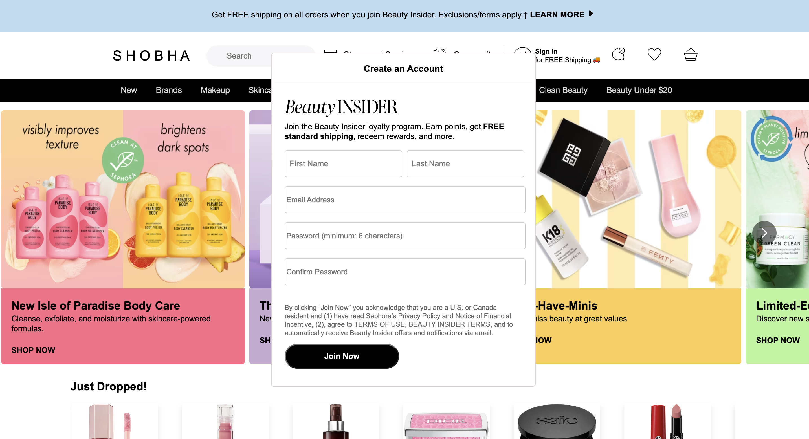

 - Product Browsing: Browse through a number of Beauty products, browse by category or brand. 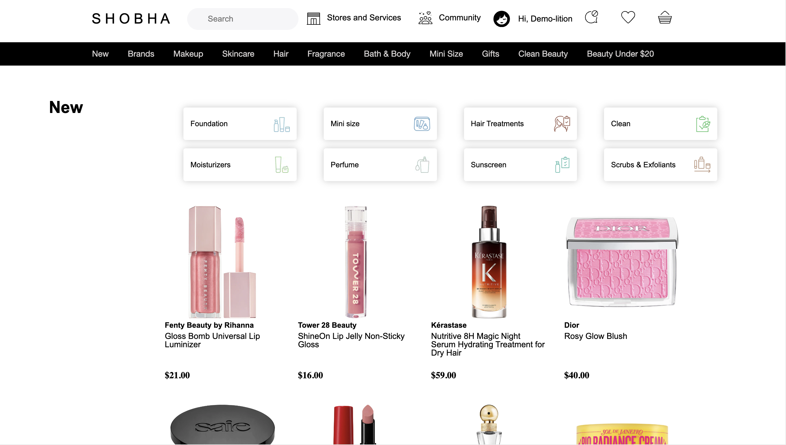

 - Shopping Basket: Add products to your shopping basket, and alter quantities in the basket. 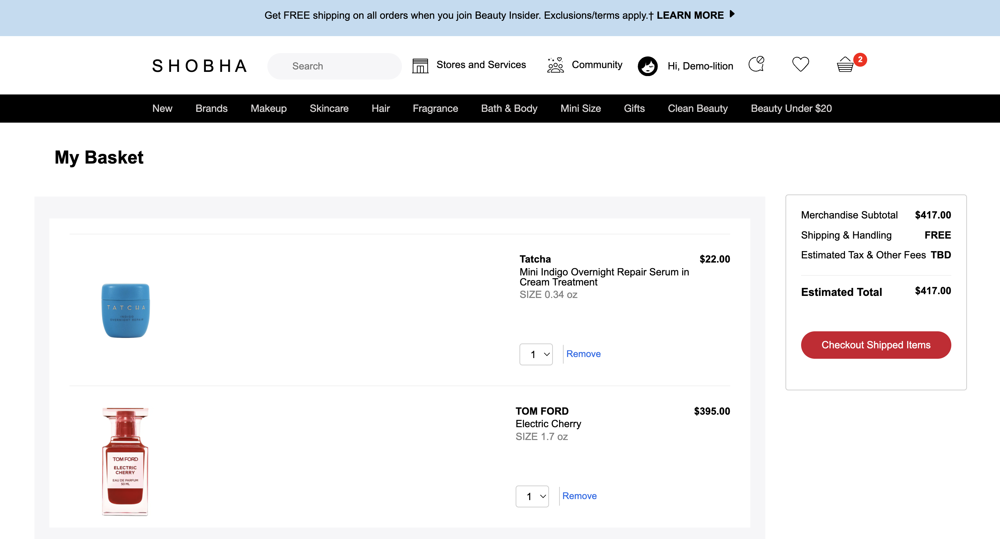

 - Product Reviews: Share your insights about a specific product by leaving a review and rating, enabling others to make informed decisions while enhancing the overall shopping community. 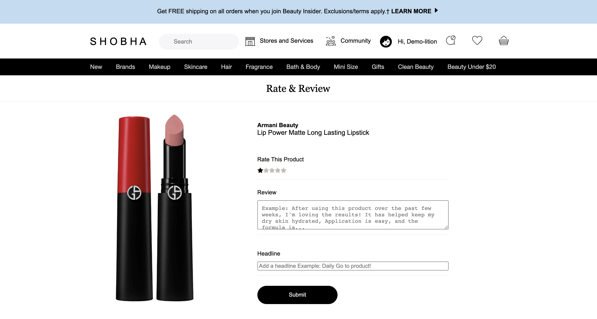

 - Wishlist: Add products to your wishlist, and have them all in one place, where you can add them to your cart. 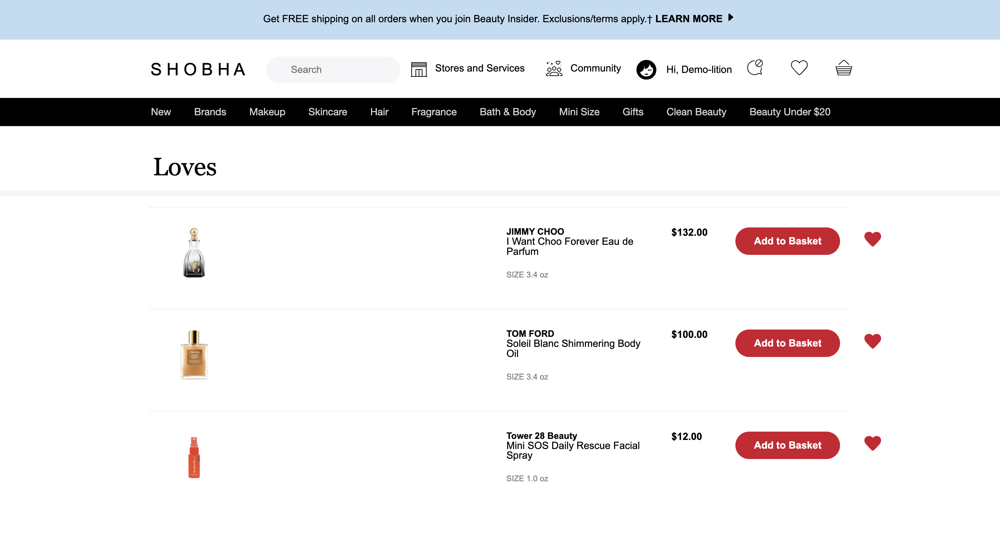

 - Store Locater: Enter a zipcode and find the nearest location to you.  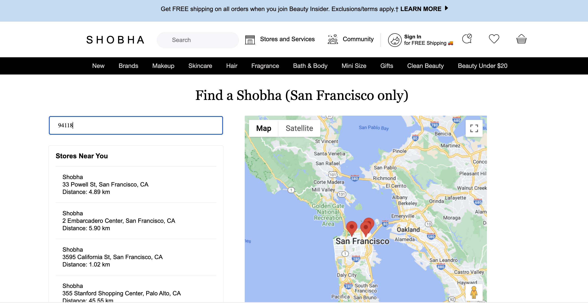

 # Dive Deeper!

User Authentication:

 
The provided code implements a robust user registration and login system within a Ruby on Rails application. It leverages the ActiveRecord ORM to interact with the database and integrates the Bcrypt gem to ensure secure password hashing and authentication.
 
 

 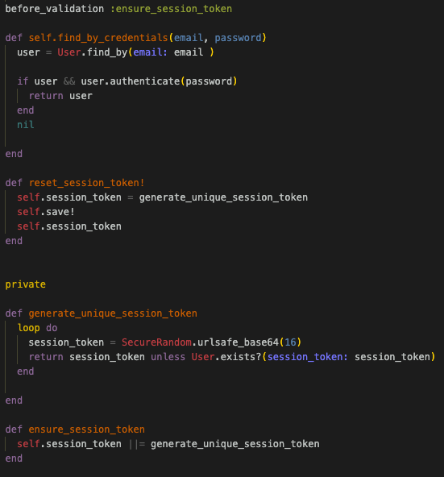

Product Browsing:

 
The following code allows users to browse and search through a number of Beauty products, filtered by category or brand. The search action takes a query parameter from the user, searches for products matching the query using the Product model's search method, and displays the search results in the search view. The brand action filters the products based on the brand parameter provided by the user and displays the filtered products in the brand view.The category action searches for products that belong to all the specified categories, and displays the filtered products in the category view. The code efficiently combines the results from multiple category queries using the & operator to find the products that belong to all the specified categories.
 
 

 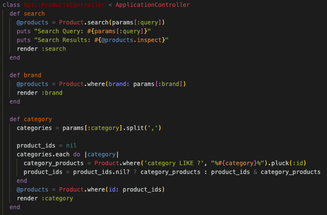

  
 In this code, each thunk action creator (fetchSearchResults, fetchProductsByBrand, fetchProductsByCategory) returns a function that has access to the dispatch function from the Redux store. Inside these functions, asynchronous API calls are made using fetch, and once the data is received, the corresponding action (receiveProducts) is dispatched with the fetched data.
  
  

  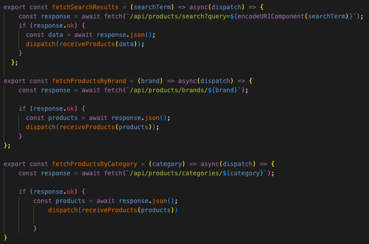

Basket Items:

 
This code handles adding an item to the cart for authenticated users. If the user is not logged in, it displays a modal to prompt login/signup. Otherwise, it adds the selected item to the cart, displays a success notification, and hides it after a short interval.
 
 

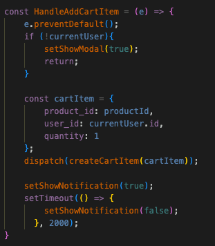

Reviews:

 
The Api::ReviewsController is responsible for handling various CRUD (Create, Read, Update, Delete) operations for reviews related to products, providing the necessary endpoints.
This index action retrieves all the reviews associated with a specific product. The create action initializes a new Review object with the parameters received in the request (review_params). It sets the user_id of the review to the current_user's ID (assuming there's a user session). If the review is successfully saved, it renders the show view to display the created review; otherwise, it renders a JSON response with the error messages and a status of 422 for an unprocessable entity. The show action retrieves and displays a specific review based on the id parameter passed in the request. 
 
 

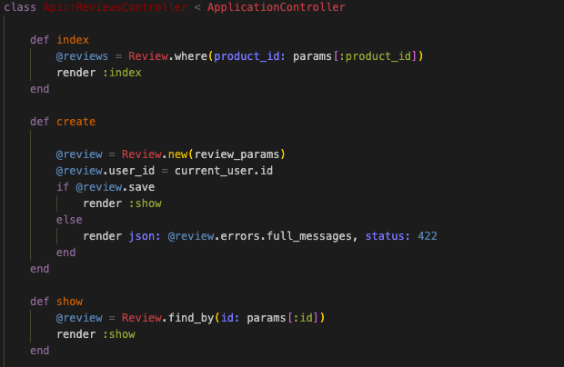

 
This 'review_params' private method is used to sanitize and permit only specific attributes (product_id, title, rating, body, user_id) from the parameters received in the request. It helps prevent mass-assignment vulnerabilities.
 
 

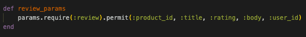

 

### Add Items to Your Wishlist
***

 

### Add Items to Your Basket
***

# Installation 

To get started with Shobha locally, follow these steps:

1. Clone the repository: 
git clone https://github.com/jasvneet/shobha.git

2. Install the required dependencies: 
cd shobha bundle install npm install

3. Set up the database:
rails db:create rails db:migrate rails db:seed

4. Start the Rails server:
rails s

5. Open a new terminal window and start the React development server:
cd frontend npm install npm start

6. Visit http://localhost:3000
in your browser to explore the app locally.

 # Technologies Used

 - Backend: Ruby on Rails
 - Frontend: React, Redux, JavaScript, HTML5, CSS3
 - Database: PostgreSQL
 - Image Hosting: Amazon S3
 - Deployment: Render
 - Map: Google Maps API

 # Future Features

 - Filtering of products by size and price. 
 - Add abililty to choose a color or size for a product if varieties available. 